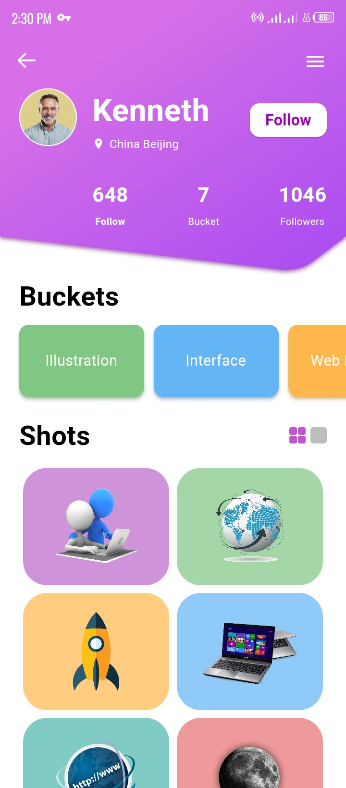
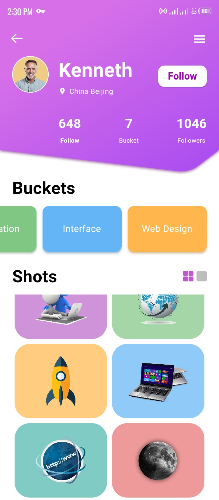
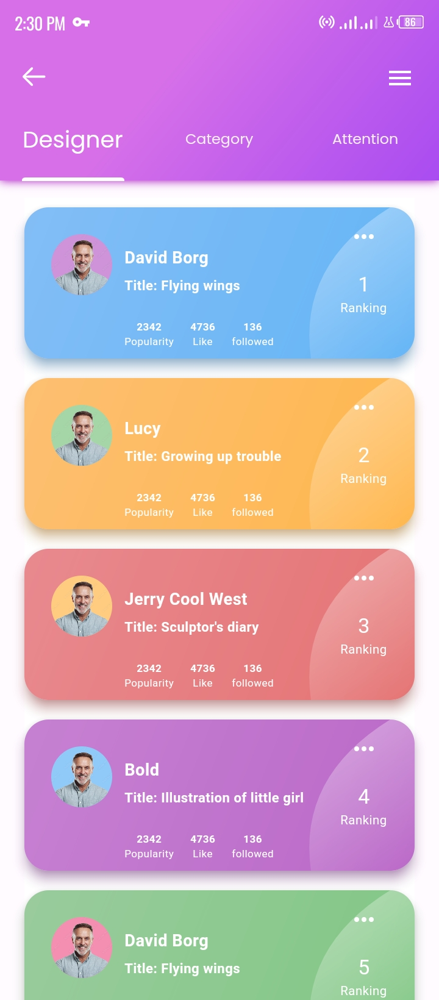
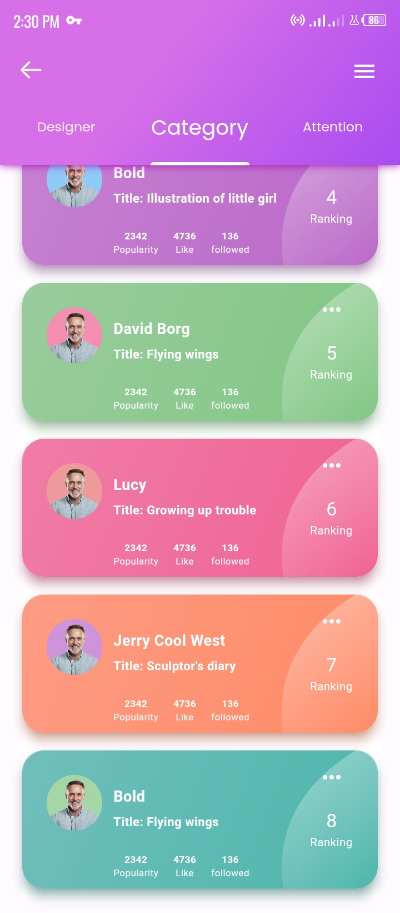

# designers_app_ui

Random Designers Flutter Application with 2 functional screens.

- Dashboard Screen
- Home Screen

## Features/Implementations

- Material 3
- Gradient Appbar
- Profile Avatar
- Route Navigation
- Vertical ListView
- Horizontal ListView
- Custom Gradient Painters
- Gradient Tabs
- Custom Font
- Animation
- Etc.,

## Screenshots






## Dependency
```yaml
dependencies:
  flutter:
    sdk: flutter

  fontresoft:
    git:
      url: git@github.com:kenresoft/fontresoft.git
      ref: master
  extensionresoft:
    git:
      url: git@github.com:kenresoft/extensionresoft.git
      ref: master
  
  go_router: ^6.5.5
  flutter_riverpod: ^2.3.3
```

## Getting Started

This project is a starting point for a Flutter application.

A few resources to get you started if this is your first Flutter project:

- [Lab: Write your first Flutter app](https://docs.flutter.dev/get-started/codelab)
- [Cookbook: Useful Flutter samples](https://docs.flutter.dev/cookbook)

For help getting started with Flutter development, view the
[online documentation](https://docs.flutter.dev/), which offers tutorials,
samples, guidance on mobile development, and a full API reference.
